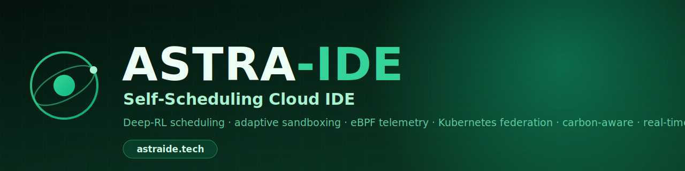
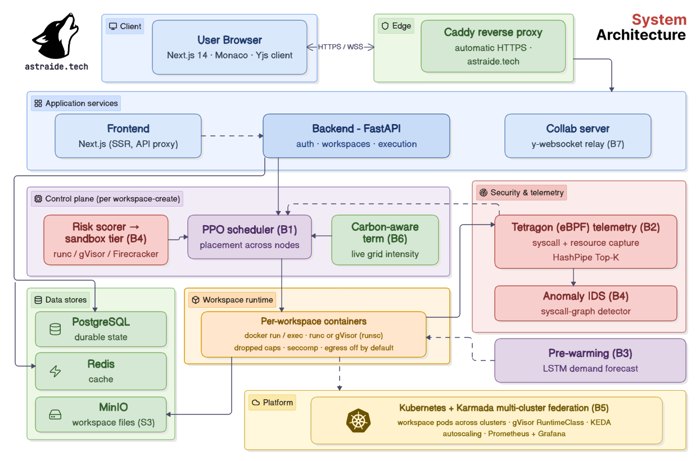
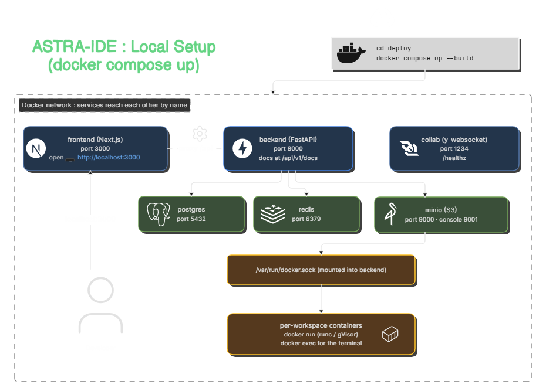

<p align="center">
  
</p>

<p align="center">
  <a href="https://astraide.tech"><b>astraide.tech</b></a>
  &nbsp;&middot;&nbsp; Deep-RL scheduling &nbsp;&middot;&nbsp; gVisor sandboxing &nbsp;&middot;&nbsp; eBPF telemetry &nbsp;&middot;&nbsp; Kubernetes federation &nbsp;&middot;&nbsp; carbon-aware &nbsp;&middot;&nbsp; real-time collaboration
</p>

# ASTRA-IDE

**A cloud development environment with a self-optimizing control plane.**

ASTRA-IDE is a browser-based cloud IDE where every workspace runs as an isolated, server-side
sandbox. What sets it apart is the control plane: scheduling, isolation, observability, and
placement are adaptive, data-driven decisions rather than fixed configuration. A reinforcement
learning scheduler places workloads, a risk model selects the cheapest sufficient sandbox,
eBPF traces syscalls, a forecaster pre-warms containers, Kubernetes federation provides
failover, placement follows the cleanest available electricity, and editing is collaborative in
real time.

Live: **https://astraide.tech**

Keywords: cloud IDE, reinforcement-learning scheduler, gVisor sandboxing, eBPF observability,
Kubernetes, Karmada multi-cluster federation, carbon-aware scheduling, CRDT collaboration,
Monaco editor, FastAPI, Next.js.

---

## What it is

Cloud IDEs such as GitHub Codespaces, Gitpod, and Replit fix their scheduling, isolation, and
placement policies. ASTRA-IDE treats each of those as a measurable optimization. The result is
a working IDE (Monaco editor, real per-workspace containers, an integrated terminal, code
execution, and live collaboration) sitting on top of seven research contributions, each with
its own evaluation harness and a real-dataset benchmark.

The platform runs today on a single host via Docker Compose and scales out to Kubernetes with
gVisor sandboxing, Karmada federation, and Tetragon-based eBPF telemetry.

---

## Key features

- **Learned workload scheduling.** A PPO reinforcement-learning agent (PF-MPPO) places each
  workspace's startup task graph across heterogeneous nodes, trained on the Google Cluster
  Trace 2011. It replaces round-robin and FIFO heuristics and falls back to a heuristic scorer
  automatically if the model is unavailable.
- **Adaptive sandboxing.** A static risk model scores each workload and assigns the cheapest
  isolation tier that is strong enough (runc, gVisor, or Firecracker) instead of paying the
  worst-case overhead for everyone.
- **Graph-based intrusion detection.** A multi-scale syscall-graph anomaly detector flags
  container escapes and exploits from syscall behavior, trained on normal traffic only.
- **eBPF observability.** Tetragon captures per-workspace syscall and resource telemetry in the
  kernel with near-zero overhead, feeding both the scheduler and the intrusion detector.
- **Predictive pre-warming.** An LSTM forecasts session demand and adapts container keep-alive
  windows, cutting cold-start latency.
- **Multi-cluster federation.** Karmada spreads workspaces across clusters with automatic
  failover; a global optimizer balances load ahead of demand.
- **Carbon-aware placement.** Deferrable work is shifted toward low-carbon grid windows using
  live carbon-intensity data.
- **Real-time collaboration.** Multiple users edit the same file concurrently with conflict-free
  CRDT synchronization (Yjs) and live cursors.

---

## Inside a workspace

Each workspace is an isolated development environment. Starting it runs a real container for the
project's language; stopping it tears the container down (your files persist either way, but the
shell and live preview need a running container).

What a running workspace gives you:

- **Editor.** Monaco with syntax highlighting, multi-cursor collaboration and themes. A path bar
  above the file shows the current file's workspace-relative path and copies it in one click.
- **Interactive terminal.** A real shell running inside the workspace container (not a mock),
  bridged to the browser over a WebSocket PTY. The same file tree is visible in the Explorer.
- **Run.** Execute the current file in the sandbox and see stdout, stderr and problems.
- **Preview.** Two modes: serve the workspace's static files, or run a dev server on a port and
  preview it live. The Preview panel detects the ports your server is listening on and proxies
  the one you pick, so you can iterate on a web app without leaving the IDE.

To try every feature quickly, import the sample projects from
[`astra-ide-samples`](https://github.com/PrasannaMishra001/astra-ide-samples): a static site for
static preview, a dev server for the port proxy, and workloads that trip different sandbox tiers.

---

## Benchmark results

Each contribution is evaluated on a real public dataset. Representative numbers:

| Area | Dataset | Result |
|---|---|---|
| Intrusion detection | LID-DS 2021 (real CVE exploits) | F1 **0.82**, precision 0.95, FPR 0.04; beats STIDE (0.75) and a frequency baseline (0.73) |
| Predictive pre-warming | Azure Functions 2019 | forecast N-RMSE **0.17**; **49%** fewer cold starts vs a fixed keep-alive window |
| Carbon-aware scheduling | UK grid carbon intensity | up to **30%** lower emissions at a 24-hour deferral budget |
| Learned scheduling | Google Cluster Trace 2011 | PPO policy trained on the real trace; outperforms random workspace placement |

Evaluation harnesses live under `benchmarks/`; trained model artifacts and their metrics live
under `ml/*/artifacts/`.

---

## Architecture

A browser client (Next.js and Monaco) talks to a FastAPI backend behind a Caddy reverse proxy
with automatic HTTPS. The backend scores each new workspace for risk, asks the scheduler for a
placement, and launches an isolated container under the selected runtime. A separate WebSocket
service relays CRDT document updates for collaboration. PostgreSQL holds durable state, Redis
provides caching, and MinIO stores workspace files. At cluster scale the same workloads run as
Kubernetes pods federated by Karmada, observed by Tetragon, and isolated by gVisor.

<p align="center">
  
</p>

---

## Tech stack

| Layer | Technologies |
|---|---|
| Frontend | Next.js 14, TypeScript, Tailwind CSS, Monaco Editor, Yjs, Framer Motion |
| Backend | FastAPI, SQLAlchemy 2.0, Pydantic v2, PostgreSQL, Redis, MinIO, JWT |
| Machine learning | PyTorch, Gymnasium, scikit-learn, NumPy, pandas |
| Runtime and infra | Docker, Kubernetes, Karmada, Helm, KEDA, Tetragon (eBPF), Prometheus, Grafana |
| Sandboxing | runc, gVisor (runsc), Firecracker via Kata Containers |
| Collaboration | Node.js, y-websocket |
| Delivery | GitHub Actions, GHCR, Caddy |

---

## Run it locally

Requirements: Docker Desktop (or Docker Engine and Compose) and Git.

```bash
git clone https://github.com/PrasannaMishra001/astra-ide.git
cd astra-ide/deploy
docker compose up --build
```

First build takes a few minutes; subsequent starts take seconds. Then open:

- Frontend: http://localhost:3000
- Backend API docs: http://localhost:8000/api/v1/docs
- Collaboration server health: http://localhost:1234/healthz

No configuration is required. Optional features (Google and GitHub sign-in, live
carbon-intensity data) activate when their credentials are set in `backend/.env`; without them
the platform falls back gracefully. Stop with `docker compose down`, or
`docker compose down -v` to also remove data.

<p align="center">
  
</p>

---

## Repository layout

```
astra-ide/
  backend/         FastAPI service: auth, workspaces, scheduling, risk scoring, telemetry
  frontend/        Next.js IDE: Monaco editor, collaboration, dashboards
  collab-server/   y-websocket relay for CRDT collaboration
  ml/              scheduler (PPO), prewarming (LSTM), risk scorer, anomaly IDS, telemetry,
                   federation, carbon; trained artifacts under ml/*/artifacts/
  benchmarks/      per-contribution evaluation harnesses on real datasets
  ebpf/            Tetragon tracing policy
  k8s/             manifests, Helm chart, Karmada policies, RuntimeClasses, monitoring
  deploy/          Docker Compose stacks and the Caddy reverse proxy
```

---

## License

Research project. License to be finalized before public release.
